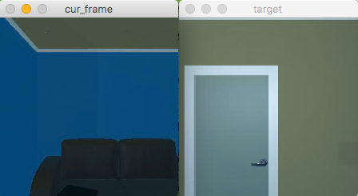

# DRL
Deep Reinforcement Learning


## THOR

+ **Prepare**

	+ Enter THOR directory and set THOR_HOME env_var
	
		```
		cd THOR
		# set THOR_HOME env_var
		# (or you can simply set it in your ~/.bashrc file for convenience)
		export THOR_HOME=$(pwd)
		```

	+ Download THOR's binary build and construct environment DB
	
		```
		# get THOR's binary build
		./get_thor_binaries.sh
		
		# build environment DB 
		python script_build_db.py
		```
	
		**Or** you can download the environment DBs from [here](https://cmu.box.com/s/udt9zltav06qvga56f1envt8ock6byo6) and put them under `THOR/env_db_a4` folder.

	+ Randomly collect target images in the scene
	
		```	
		# collect target images 
		python script_generate_targets.py
	
		```
		
		**Or** you can download target images from [here](https://cmu.box.com/s/fy49k0zo6hhumxld0fp3r6h7biow5rld) and decompress it **to** `THOR/target_images` folder.
	
+ **HumanControledAgent**

	This is an agent which you can control to interact with the environment. To launch HumanControledAgent, type the following command:
	
	```
	python THORHumanAgent.py
	```
	
	
	+ commands:
		
		| cmd| action name|
		|---|-------------|
		|`w`| MoveForward |
		|`s`| MoveBackward|
		|`a`| MoveLeft    |
		|`d`| MoveRight   |
		|`j`| RotateRight |
		|`l`| RotateLeft  |
		|`i`| LookUp      |
		|`k`| LookDown    |
	
+ **Extract RESNET Feature**

	This is to extract Resnet feature for offline environment. 

	First, clone the Resnet project from [here](https://github.com/KaimingHe/deep-residual-networks) at the same level of this project.

	Second, download the Resnet pretrain model and decompress it **to** `RESNET_PATH/pretrain_models` folder.

	To extract the feature, type:
	
	```
	python extract_resnet_feature.py input_image_npy output_feature_npy
	```

	The extracted feature will be saved **to** `output_feature_npy`